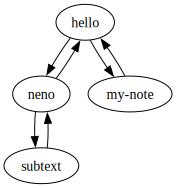

# subtext

Subtext is a tool that helps you managing your notes written in subtext specification format.

## rename

    subtext rename -d example hello welcome

To see what the would happen if you run this command you can use the dry run option -n:

    subtext rename -d example -n hello welcome

The default file extension is subtext. If you want to change that use the -e option:

    subtext rename -d example/md -e md hello welcome

## batch rename

With batch_rename you can do renames in a batch mode.
The batch mode can rename multiple notes at once.

For the source pattern you can use the dot to select all notes.
Adding subtext/ in front of all notes

    subtext batch-rename -d example -n . subtext/

To remove the same prefix of multiple notes you cab use the dot as target.

Revert the renaming above:

    subtext batch-rename -d example -n subtext/ .

Add example in front of every note beginning with test:

    subtext batch-rename -d example -n test example

Revert the renaming above:

    subtext batch-rename -d example -n example .

## graph

The graph command crates a [dot](https://graphviz.org/docs/layouts/dot/) grapth
that can be further processed to an image. Here is an example with the graphviz dot command:

    subtext graph -d example example_graph | dot -Tsvg > example/example.svg

## Build and install

First you have to install [OCaml](https://ocaml.org/) and dune.

Install libraries:

    opam install core_unix re2 ppx_jane ounit2

Compile:

    dune build

Copy the binary to you bin directory:

    cp _build/install/default/bin/subtext /usr/local/bin 

## Links

See also: https://github.com/polyrainbow/neno/

